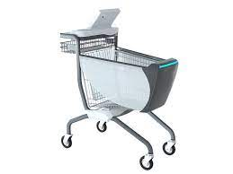
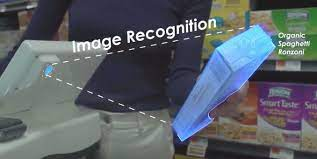

# Data Augmentation and Annotation  
This is a Python script to automate the data augmentation and annotation of images for Object Detection problems.  
This script helped me in annotating the object of interest for the data collected by myself.  
  
## Problem Statement  
Originally, the problem was to build a system for the brand recognition and detection (i.e., identifying the brand of an item and also creating a bounding box around it) for the shopping cart use case.  
In this use case (i.e., shopping cart use case), an edge device will be mounted over the shopping cart with a camera attached to it. As the customer will put an item in the shopping cart, the edge device will recognize and detect that item and accordingly increase the cart value. Similarly, when customer will take out an item from the shopping cart, the edge device will identify the item and re-adjust the cart value.  
The overall system will look something like the below pictures:  
  
  
  
  
## Function of this Script  
Since for this problem statement, I did't have any dataset, thus I created my dataset and annotated it by myself.  
For this purpose, I recorded tiny video of products in such a way so that the position of product remain almost unchanged but the background changes. To accomplish this, I hold product in one hand and camera in another hand. Then, I move product and camera relatively constant to each other. This way, the position of the product remain constant in the video but the background changes.  
Watch the below video to understand this technique:  
