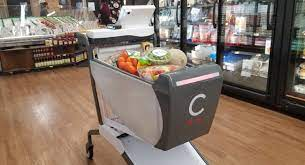

# Data Augmentation and Annotation  
This is a Python script to automate the data augmentation and annotation of images for Object Detection problems.  
This script helped me in annotating the object of interest for the data collected by myself.  
  
## Problem Statement  
Originally, the problem was to build a system for the brand recognition and detection (i.e., identifying the brand of an item and also creating a bounding box around it) for the shopping cart use case.  
In this use case (i.e., shopping cart use case), an edge device will be mounted over the shopping cart with a camera attached to it. As the customer will put an item in the shopping cart, the edge device will recognize and detect that item and accordingly increase the cart value. Similarly, when customer will take out an item from the shopping cart, the edge device will identify the item and re-adjust the cart value.  
The overall system will look something like the below pictures:  
  
  
  
  
## Function of this Script  
Since for this problem statement, I did't have any dataset, thus I created my dataset and annotated it by myself.  
For this purpose, I recorded tiny video of products in such a way so that the position of product remain almost unchanged but the background changes. To accomplish this, I hold product in one hand and camera in another hand. Then, I move product and camera relatively constant to each other. This way, the position of the product remain constant in the video but the background changes.  
Watch the below video to understand this technique:  
  
  
Following are the steps:  
1. Extract all frames by using FFMPEG tool from the shooted video  
2. On the first frame, annotate the location of object (i.e., top-left and bottom-right coordinates) by using the [click-coordinate script](https://github.com/sansinghsanjay/Misc_python_scripts/tree/master/ClickCoordinates).  
3. Save the coordinates of the bounding box with top-left coords in the first line and bottom-right coords in the second file in an image with extension "txt". This .txt file should be in the same file where we have extracted the frames from video by using FFMPEG command.  
4. Now, update the CLASSNAME and CREATE_BB (make it "True" if you want bounding box on all images to verify if all annotations are correct or not; and "False" is you don't want bounding box on generated data)  
5. Change the paths at the beginning of the script. provide the following three paths:  
	1. Path of all frames. This path should have all frames (for a particular class, classname mentioned in the above step) and a ".txt" with coordinates mentioned in the above step  
	2. Output path for images  
	3. Output path for bounding box ".txt" files. Each output image will have a ".txt" file with the same name providing the information of bounding box in that image for training purpoe. All these text files have bounding box coordinates in the KITTI format. In this format, we have following elements:  
	`<classname> 0 0 0 x1 y1 x2 y2 0 0 0 0 0 0 0`  
	Please not that after classname, there are 3 zeros, then top-left coords (x1, y1), bottom-right coords (x2, y2), and finally 7 zeros. Following is the description of each of these elements:  
	  
6. Now, run the script. This script will generated the following variations of all the frames:  
	1. Simple copy of the original image (1 copy)  
	2. Shift left with five randomly generated locations (5 copy)  
	3. Shift right with five randomly generated locations (5 copy)  
	4. Shift top with five randomly generated locations (5 copy)  
	5. Shift bottom with five randomly generated locations (5 copy)  
	6. Shift top-left with five randomly generated locations (5 copy)  
	7. Shift top-right with five randomly generated locations (5 copy)  
	8. Shift bottom-left with five randomly generated locations (5 copy)  
	9. Shift bottom-right with five randomly generated locations (5 copy)  
	10. Zoom-in by three scaling factors (3 copy)  
	11. Zoom-out by three scaling factors (3 copy)  
	12. Rotation at three different angles in clockwise direction(3 copy)  
	13. Rotation at three different angles in anti-clockwise direction (3 copy)  
	All the above operations (or data augmentation techniques) will result in total 
	53 different copies of each frame. Consequently, the data size will become very huge.
7. +  
  
## Technology Used  
Following are the details:  
* Windows 10 Enterprise (64 bit)  
* Python 3.8.10
* Python Packages:  
	* os  
	* cv2  
	* random  
	* shutil  
	* numpy  